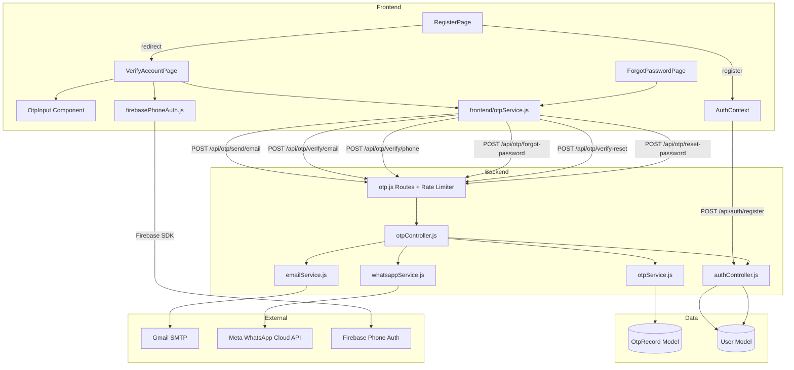
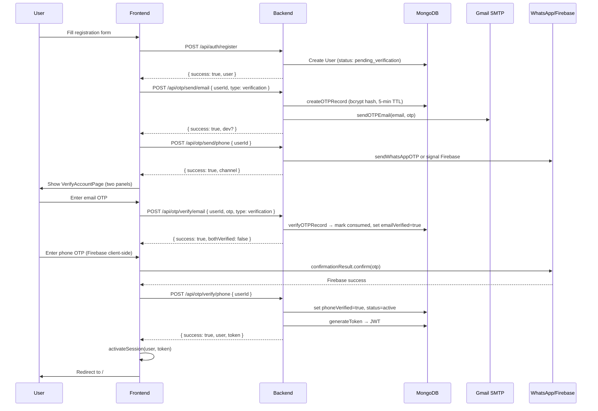
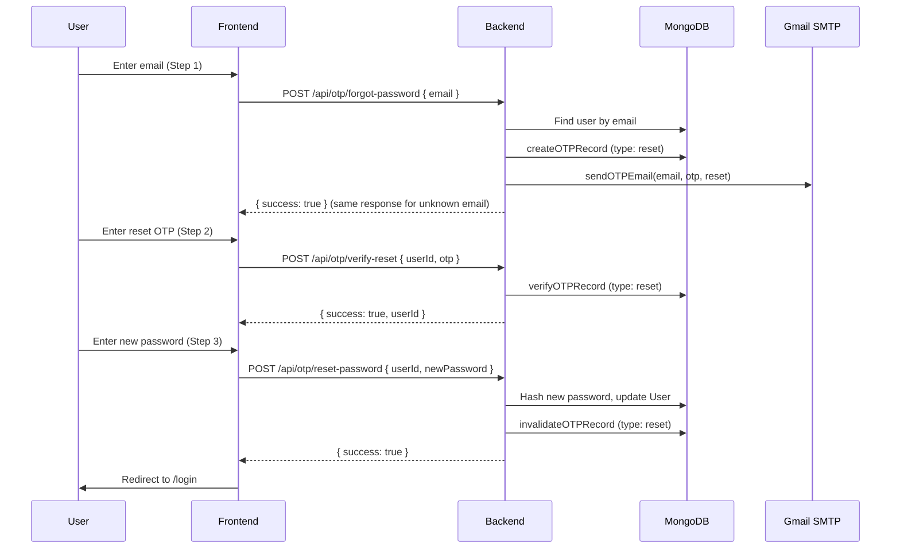

# Design Document: OTP Verification

## Overview

This document describes the technical design for the OTP (One-Time Password) verification feature for the Siddha Organics e-commerce application. The feature provides two-factor identity verification via email (Nodemailer + Gmail SMTP) and phone (Firebase Authentication client-side, with Meta WhatsApp Cloud API as an optional backend delivery channel). OTP verification is required during three user flows: new account signup, login for unverified accounts, and password reset.

### Goals

- Secure account activation requiring both email and phone verification before a JWT is issued
- Cryptographically safe OTP storage (bcrypt hashes, never plain text)
- Graceful dev-mode fallback when external credentials are absent
- Rate limiting and attempt lockout to resist brute-force attacks
- Clean, accessible UI components consistent with the existing Tailwind/green theme

### Non-Goals

- Two-factor authentication for already-active users on every login (this is account activation only)
- SMS delivery via Twilio or other paid SMS gateways (Firebase free tier is used)
- OTP delivery via push notifications

---

## Architecture

The feature spans three layers: the MongoDB data layer (OtpRecord model), the Express backend (OTP service, WhatsApp service, OTP controller, rate-limited routes), and the React frontend (OtpInput component, VerifyAccountPage, ForgotPasswordPage, frontend OTP service, AuthContext update).



### Request Flow: Signup Verification



### Request Flow: Forgot Password



---

## Components and Interfaces

### Backend Components

#### OtpRecord Model (`backend/src/models/OtpRecord.js`)

Mongoose model for persisting hashed OTP records.

#### OTP Service (`backend/src/services/otpService.js`)

Pure business logic for OTP lifecycle management. No HTTP concerns.

```
generateOTP() → string
createOTPRecord(userId, type, channel) → { otp: string, record: OtpRecord }
verifyOTPRecord(userId, type, channel, otp) → { success: boolean, error?: string, consumed?: boolean }
invalidateOTPRecord(userId, type, channel) → void
```

#### WhatsApp Service (`backend/src/services/whatsappService.js`)

Delivers OTP via Meta WhatsApp Cloud API with dev-mode fallback.

```
sendWhatsAppOTP(phone, otp) → { success: boolean, channel: 'whatsapp'|'sms'|'dev', fallback?: boolean, dev?: boolean }
```

#### OTP Controller (`backend/src/controllers/otpController.js`)

HTTP handler layer. Validates inputs, orchestrates service calls, formats responses.

```
sendEmailOTP(req, res)      — POST /api/otp/send/email
sendPhoneOTP(req, res)      — POST /api/otp/send/phone
verifyEmailOTP(req, res)    — POST /api/otp/verify/email
verifyPhoneOTP(req, res)    — POST /api/otp/verify/phone
forgotPassword(req, res)    — POST /api/otp/forgot-password
verifyReset(req, res)       — POST /api/otp/verify-reset
resetPassword(req, res)     — POST /api/otp/reset-password
```

#### OTP Routes (`backend/src/routes/otp.js`)

Express router with `express-rate-limit` middleware applied per route group.

### Frontend Components

#### OtpInput (`frontend/src/components/ui/OtpInput.jsx`)

Reusable 6-box OTP input component. Props:

```
value: string           — current 6-digit string
onChange: (otp) => void — called with new value on each change
loading: boolean        — disables input and shows spinner
error: string|null      — error message shown below boxes
success: boolean        — shows green success state
disabled: boolean       — fully disables the component
```

#### VerifyAccountPage (`frontend/src/pages/user/VerifyAccountPage.jsx`)

Route: `/verify-account`. Requires `location.state.userId`, `location.state.email`, `location.state.phone`.

Two-panel layout: Email Verification panel + Phone Verification panel. Each panel contains an OtpInput, Verify button, and Resend button with 30-second countdown. "Complete Registration" button enabled only when both panels are verified.

#### ForgotPasswordPage (`frontend/src/pages/user/ForgotPasswordPage.jsx`)

Route: `/forgot-password`. Three-step wizard:
- Step 1: Email input form
- Step 2: OtpInput for reset code
- Step 3: New password + confirm password form

#### Frontend OTP Service (`frontend/src/services/otpService.js`)

Thin API call wrappers using native `fetch`. No OTP logic — all verification logic lives on the backend.

```
sendEmailOTP(userId, type) → Promise<{ success, dev?, devOtp? }>
sendPhoneOTP(userId) → Promise<{ success, channel, dev? }>
verifyEmailOTP(userId, otp, type) → Promise<{ success, user?, token?, error? }>
verifyPhoneOTP(userId) → Promise<{ success, user?, token?, error? }>
forgotPassword(email) → Promise<{ success, userId?, error? }>
verifyReset(userId, otp) → Promise<{ success, userId?, error? }>
resetPassword(userId, newPassword) → Promise<{ success, error? }>
```

### Component Tree

```
App
└── Router
    ├── /register → RegisterPage
    │   └── (on success) → navigate('/verify-account', { state: { userId, email, phone } })
    ├── /verify-account → VerifyAccountPage
    │   ├── EmailPanel
    │   │   └── OtpInput
    │   └── PhonePanel
    │       ├── OtpInput
    │       └── #recaptcha-container (invisible)
    ├── /forgot-password → ForgotPasswordPage
    │   ├── Step1: EmailForm
    │   ├── Step2: OtpInput
    │   └── Step3: NewPasswordForm
    └── /login → LoginPage
```

---

## Data Models

### OtpRecord Schema

```javascript
// backend/src/models/OtpRecord.js
{
  userId:    { type: ObjectId, ref: 'User', required: true, index: true },
  type:      { type: String, enum: ['verification', 'reset'], required: true },
  channel:   { type: String, enum: ['email', 'phone'], required: true },
  otpHash:   { type: String, required: true },        // bcrypt hash, cost factor 10
  expiresAt: { type: Date, required: true, index: true }, // TTL index for auto-cleanup
  attempts:  { type: Number, default: 0, max: 3 },
  consumed:  { type: Boolean, default: false },
}
// Compound unique index: { userId, type, channel } — one active record per slot
// TTL index: { expiresAt: 1 }, expireAfterSeconds: 0
```

The compound index `{ userId: 1, type: 1, channel: 1 }` with `unique: true` ensures that `createOTPRecord` can safely upsert (replace) an existing record for the same slot, implementing the "resend replaces previous OTP" requirement atomically.

### User Schema (existing, relevant fields)

```javascript
// Existing fields used by this feature:
emailVerified: { type: Boolean, default: false }
phoneVerified:  { type: Boolean, default: false }
status:         { type: String, enum: ['active', 'suspended', 'pending_verification'], default: 'pending_verification' }
```

No schema changes are needed to the User model.

### API Request/Response Contracts

#### POST /api/otp/send/email
```
Request:  { userId: string, type: 'verification' | 'reset' }
Response: { success: true, dev?: boolean }
Errors:   400 (missing fields), 404 (user not found), 429 (rate limit), 500 (email failure)
```

#### POST /api/otp/send/phone
```
Request:  { userId: string }
Response: { success: true, channel: 'whatsapp' | 'sms' | 'dev', dev?: boolean }
Errors:   400 (missing fields), 404 (user not found), 429 (rate limit)
```

#### POST /api/otp/verify/email
```
Request:  { userId: string, otp: string, type: 'verification' | 'reset' }
Response: { success: true, bothVerified: boolean, user?: object, token?: string }
Errors:   400 (invalid OTP format), 404 (user not found), 422 (wrong OTP / expired / locked)
```

#### POST /api/otp/verify/phone
```
Request:  { userId: string }
Response: { success: true, bothVerified: boolean, user?: object, token?: string }
Errors:   400 (missing userId), 404 (user not found)
Note:     Phone OTP is verified client-side by Firebase. This endpoint only marks phoneVerified=true.
```

#### POST /api/otp/forgot-password
```
Request:  { email: string }
Response: { success: true }   (always — anti-enumeration)
Errors:   400 (missing email), 429 (rate limit)
Note:     userId is returned only in dev mode for testing convenience.
```

#### POST /api/otp/verify-reset
```
Request:  { userId: string, otp: string }
Response: { success: true, userId: string }
Errors:   400 (invalid format), 404 (user not found), 422 (wrong OTP / expired / locked)
```

#### POST /api/otp/reset-password
```
Request:  { userId: string, newPassword: string }
Response: { success: true }
Errors:   400 (weak password / missing fields), 404 (user not found), 422 (no verified reset token)
```

### Rate Limiting Configuration

```javascript
// Send endpoints: 5 requests per 15 minutes per IP
const sendLimiter = rateLimit({
  windowMs: 15 * 60 * 1000,
  max: 5,
  message: { error: 'Too many OTP requests. Please wait before trying again.' },
  standardHeaders: true,
  legacyHeaders: false,
})

// Verify endpoints: 10 requests per 15 minutes per IP
const verifyLimiter = rateLimit({
  windowMs: 15 * 60 * 1000,
  max: 10,
  message: { error: 'Too many verification attempts. Please wait before trying again.' },
  standardHeaders: true,
  legacyHeaders: false,
})
```

---

## Correctness Properties

*A property is a characteristic or behavior that should hold true across all valid executions of a system — essentially, a formal statement about what the system should do. Properties serve as the bridge between human-readable specifications and machine-verifiable correctness guarantees.*

The frontend uses `fast-check` (already installed as a dev dependency). The backend uses `fast-check` as well, added as a dev dependency alongside `vitest`.

### Property 1: OTP Format Validity

*For any* call to `generateOTP()`, the returned value must be a string matching `/^\d{6}$/` (exactly 6 decimal digits, in the range [100000, 999999]).

**Validates: Requirements 1.6, 11.6**

### Property 2: OTP Record Integrity

*For any* valid `userId` and `type`/`channel` combination, after calling `createOTPRecord(userId, type, channel)`:
- The stored `otpHash` must NOT equal the plain OTP string
- `bcrypt.compare(plainOtp, storedHash)` must return `true`
- `expiresAt` must be within 5 minutes (300 seconds) of the current time
- The `type` and `channel` fields must match the inputs exactly
- `consumed` must be `false`
- `attempts` must be `0`

**Validates: Requirements 1.2, 11.1, 11.8**

### Property 3: OTP Verification Round-Trip

*For any* valid `userId`, `type`, and `channel`, calling `createOTPRecord` followed immediately by `verifyOTPRecord` with the returned plain OTP must:
- Return `{ success: true }`
- Leave the record in a consumed state (a second call with the same OTP must fail)

**Validates: Requirements 3.1, 3.2**

### Property 4: Single-Use OTP

*For any* OTP that has been successfully verified, a subsequent call to `verifyOTPRecord` with the same OTP must return `{ success: false }`.

**Validates: Requirements 11.2**

### Property 5: Wrong OTP Increments Attempt Counter

*For any* OTP record and any string that does not match the stored OTP, calling `verifyOTPRecord` with the wrong string must increment the `attempts` field by exactly 1.

**Validates: Requirements 3.3**

### Property 6: Attempt Lockout After 3 Failures

*For any* OTP record, after exactly 3 calls to `verifyOTPRecord` with incorrect OTPs, a subsequent call with the correct OTP must return `{ success: false, error: 'Too many incorrect attempts...' }`.

**Validates: Requirements 3.4, 11.3**

### Property 7: OTP Expiry Enforcement

*For any* OTP record whose `expiresAt` is in the past, calling `verifyOTPRecord` must return `{ success: false }` with an expiry error message, regardless of whether the OTP value is correct.

**Validates: Requirements 3.5, 11.8**

### Property 8: OTP Upsert Replaces Previous Record

*For any* `userId`/`type`/`channel` slot, calling `createOTPRecord` a second time must invalidate the first OTP: verifying with the first OTP after the second `createOTPRecord` call must fail, while verifying with the second OTP must succeed.

**Validates: Requirements 8.4**

### Property 9: Dual Verification Activates Account and Issues JWT

*For any* `pending_verification` user, after both `verifyEmailOTP` and `verifyPhoneOTP` succeed:
- `user.emailVerified` must be `true`
- `user.phoneVerified` must be `true`
- `user.status` must be `'active'`
- The response must contain a valid JWT token signed with `JWT_SECRET`

**Validates: Requirements 5.1, 5.2, 5.3, 5.5**

### Property 10: Partial Verification Does Not Issue JWT

*For any* user where only one of email or phone has been verified (but not both), the verification response must NOT contain a `token` field, and `user.status` must remain `'pending_verification'`.

**Validates: Requirements 5.6**

### Property 11: Pending User Login Rejected

*For any* user with `status: 'pending_verification'`, a login attempt must return HTTP 403 with `{ needsVerification: true, userId }`.

**Validates: Requirements 5.4**

### Property 12: Anti-Enumeration on Forgot Password

*For any* email address that does not exist in the database, the `POST /api/otp/forgot-password` response must be structurally identical (same HTTP status code, same response body shape) to the response for a valid registered email.

**Validates: Requirements 10.2**

### Property 13: Password Reset Updates Credentials

*For any* valid new password that passes complexity rules, after a successful `resetPassword` call:
- The user's `passwordHash` in the database must be updated (the old password must no longer authenticate)
- The OTP record of type `reset` for that user must be invalidated (consumed or deleted)

**Validates: Requirements 10.4**

### Property 14: Password Complexity Enforcement

*For any* string that violates at least one of the password complexity rules (min 8 chars, uppercase, lowercase, digit, special character), `POST /api/otp/reset-password` must return HTTP 400 with an error message.

**Validates: Requirements 10.6**

### Property 15: No Plain OTP in Production Responses

*For any* OTP value, when `NODE_ENV === 'production'`, no response body from any `/api/otp/*` endpoint must contain the plain OTP string.

**Validates: Requirements 11.7, 1.5**

### Property 16: Invalid UserId Returns 404

*For any* userId that does not exist in the database, all `/api/otp/*` endpoints that accept a `userId` parameter must return HTTP 404.

**Validates: Requirements 11.5**

---

## Error Handling

### Backend Error Strategy

All OTP controller functions follow a consistent pattern:

1. **Input validation** — return 400 for missing or malformed fields before any DB access
2. **User lookup** — return 404 for unknown userId (no information leakage about existence)
3. **Service call** — delegate to `otpService` or `emailService`; catch and log unexpected errors
4. **Response** — never include plain OTP in response body; in production, omit `devOtp` field entirely

```javascript
// Standard error response shapes
400: { error: 'Descriptive validation message.' }
404: { error: 'User not found.' }
422: { error: 'Incorrect OTP. Please try again.' | 'OTP has expired...' | 'Too many incorrect attempts...' }
429: { error: 'Too many OTP requests. Please wait before trying again.' }
500: { error: 'Internal server error.' }  // never expose stack traces
```

### OTP Service Error Handling

`verifyOTPRecord` returns a discriminated union rather than throwing:

```javascript
{ success: true }
{ success: false, error: string, code: 'NOT_FOUND' | 'EXPIRED' | 'WRONG_OTP' | 'LOCKED' }
```

The controller maps these codes to appropriate HTTP status codes (422 for all OTP-specific failures).

### Frontend Error Handling

- Network errors (fetch throws) → display "Network error. Please try again."
- HTTP 429 → display rate limit message with countdown hint
- HTTP 422 → display the `error` field from the response body
- HTTP 500 → display generic "Something went wrong. Please try again."
- Firebase errors → mapped to user-friendly messages in `firebasePhoneAuth.js` (already implemented)

### Dev Mode Error Handling

When any backend service is in dev mode (missing credentials), the OTP value is:
- Logged to the server console (backend) or browser console (frontend Firebase)
- Returned in the API response as `devOtp` only when `NODE_ENV !== 'production'`
- Displayed in a clearly labelled amber banner in the UI

---

## Testing Strategy

### Unit Tests (Vitest)

**Backend** (`backend/src/services/otpService.test.js`):
- `generateOTP()` — format and range validation
- `createOTPRecord()` — hash storage, expiry, upsert behavior
- `verifyOTPRecord()` — round-trip, wrong OTP, expiry, lockout, single-use
- `invalidateOTPRecord()` — record deletion

**Backend** (`backend/src/controllers/otpController.test.js`):
- Input validation (missing fields, invalid formats)
- 404 for unknown userId
- Dev mode response shape
- Production mode: no OTP in response

**Frontend** (`frontend/src/services/otpService.test.js`):
- API call shapes and error handling
- Dev mode banner trigger

**Frontend** (`frontend/src/components/ui/OtpInput.test.jsx`):
- Renders 6 input boxes
- Numeric-only filtering
- Auto-focus on digit entry and backspace
- Paste support for 6-digit strings
- Loading, error, and success states

### Property-Based Tests (fast-check, Vitest)

The frontend already has `fast-check@^3.17.2` installed. Add `fast-check` to backend dev dependencies.

Each property test runs a minimum of **100 iterations**. Tag format: `// Feature: otp-verification, Property N: <property text>`

**P1 — OTP Format Validity** (`otpService.property.test.js`):
```javascript
// Feature: otp-verification, Property 1: generateOTP always returns a 6-digit numeric string
fc.assert(fc.property(fc.constant(null), () => {
  const otp = generateOTP()
  return /^\d{6}$/.test(otp) && Number(otp) >= 100000 && Number(otp) <= 999999
}), { numRuns: 100 })
```

**P2 — OTP Record Integrity** (`otpService.property.test.js`):
```javascript
// Feature: otp-verification, Property 2: stored record has bcrypt hash, correct metadata, 5-min expiry
fc.assert(fc.property(fc.uuid(), fc.constantFrom('verification', 'reset'), fc.constantFrom('email', 'phone'), async (userId, type, channel) => {
  const { otp, record } = await createOTPRecord(userId, type, channel)
  const now = Date.now()
  return record.otpHash !== otp
    && await bcrypt.compare(otp, record.otpHash)
    && record.type === type
    && record.channel === channel
    && !record.consumed
    && record.attempts === 0
    && record.expiresAt.getTime() <= now + 5 * 60 * 1000 + 1000
    && record.expiresAt.getTime() >= now + 4 * 60 * 1000
}), { numRuns: 100 })
```

**P3 — OTP Verification Round-Trip** (`otpService.property.test.js`):
```javascript
// Feature: otp-verification, Property 3: create then verify with correct OTP succeeds and consumes record
```

**P4 — Single-Use OTP** (`otpService.property.test.js`):
```javascript
// Feature: otp-verification, Property 4: verified OTP cannot be used again
```

**P5 — Wrong OTP Increments Attempts** (`otpService.property.test.js`):
```javascript
// Feature: otp-verification, Property 5: wrong OTP increments attempt counter
```

**P6 — Attempt Lockout** (`otpService.property.test.js`):
```javascript
// Feature: otp-verification, Property 6: after 3 wrong attempts, correct OTP also fails
```

**P7 — OTP Expiry Enforcement** (`otpService.property.test.js`):
```javascript
// Feature: otp-verification, Property 7: expired OTP record fails verification
```

**P8 — OTP Upsert** (`otpService.property.test.js`):
```javascript
// Feature: otp-verification, Property 8: second createOTPRecord invalidates first OTP
```

**P9 — Dual Verification Activates Account** (`otpController.property.test.js`):
```javascript
// Feature: otp-verification, Property 9: dual verification sets status=active and returns JWT
```

**P10 — Partial Verification No JWT** (`otpController.property.test.js`):
```javascript
// Feature: otp-verification, Property 10: single-channel verification does not issue JWT
```

**P11 — Pending User Login Rejected** (`authController.property.test.js`):
```javascript
// Feature: otp-verification, Property 11: pending_verification user login returns 403
```

**P12 — Anti-Enumeration** (`otpController.property.test.js`):
```javascript
// Feature: otp-verification, Property 12: unknown email returns same response as known email
```

**P13 — Password Reset Updates Credentials** (`otpController.property.test.js`):
```javascript
// Feature: otp-verification, Property 13: resetPassword updates hash and invalidates reset token
```

**P14 — Password Complexity** (`otpController.property.test.js`):
```javascript
// Feature: otp-verification, Property 14: invalid passwords are rejected by resetPassword
```

**P15 — No OTP in Production Responses** (`otpController.property.test.js`):
```javascript
// Feature: otp-verification, Property 15: production responses never contain plain OTP
```

**P16 — Invalid UserId Returns 404** (`otpController.property.test.js`):
```javascript
// Feature: otp-verification, Property 16: non-existent userId returns 404
```

### Integration Tests

- Email delivery: mock Nodemailer transporter, verify `sendMail` called with correct `to`, `subject`, and HTML containing the OTP
- WhatsApp delivery: mock `fetch` to Meta API, verify request body format; verify fallback to dev mode when credentials absent
- Rate limiting: send 6 requests to `/api/otp/send/email` within the window, verify 6th returns 429
- Firebase phone auth: mock `signInWithPhoneNumber`, verify `+91{phone}` format

### Accessibility

- OtpInput boxes use `aria-label="Digit N of 6"` and `inputmode="numeric"` for mobile keyboards
- Error messages are associated via `aria-describedby`
- Loading state uses `aria-busy="true"` on the form
- Success state uses `role="status"` for screen reader announcement
- ForgotPasswordPage step indicator uses `aria-current="step"`
