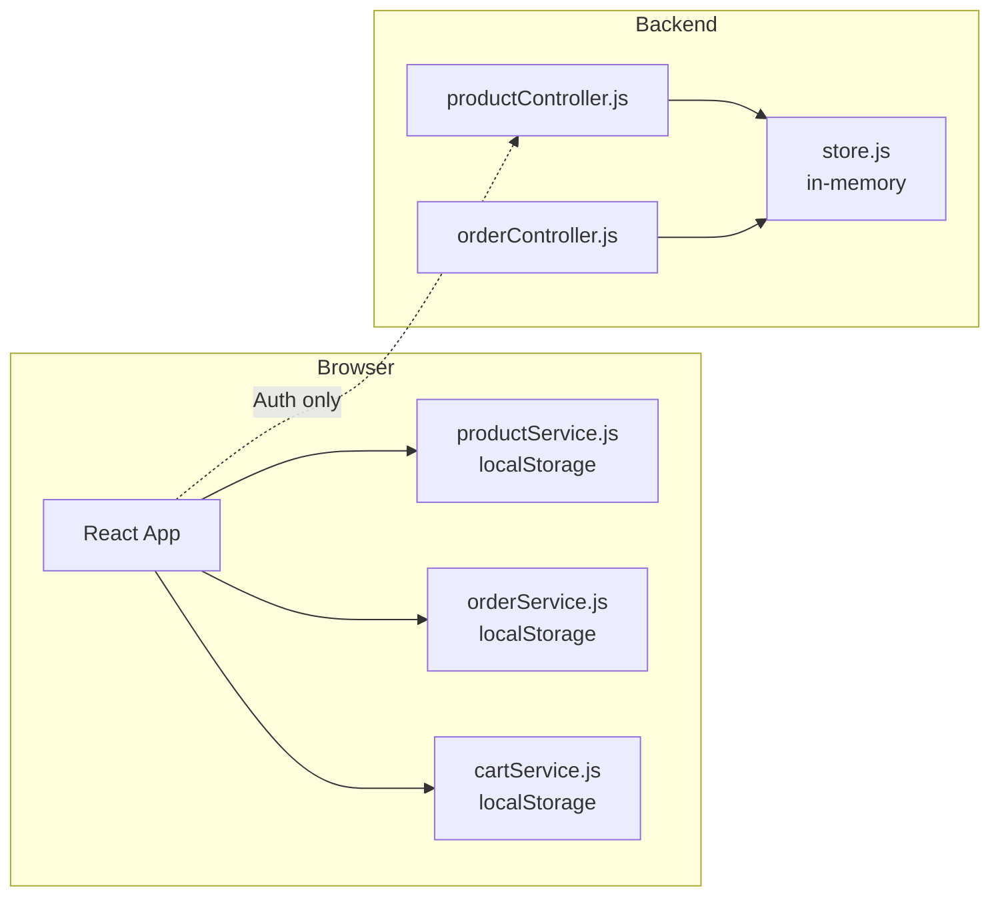
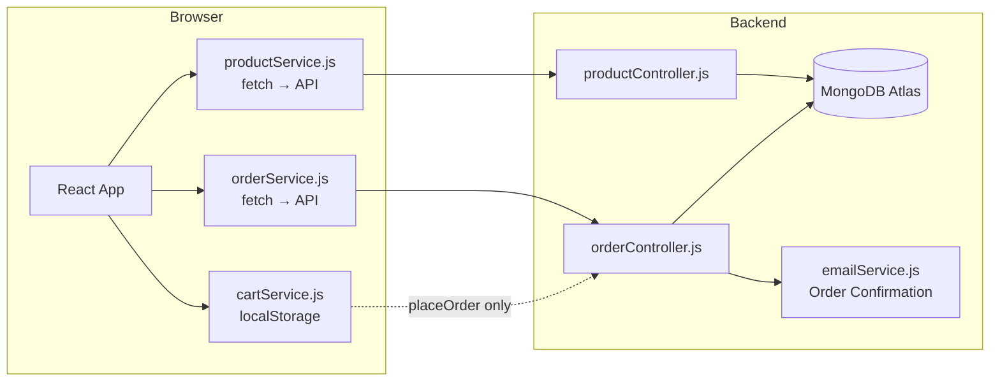

# Design Document: Production Readiness

## Overview

This design describes the migration of Siddha Organics from a prototype architecture (in-memory backend store + localStorage frontend) to a production-ready architecture backed by MongoDB Atlas. The migration touches four layers:

1. **Backend Controllers** — Replace `import { db } from '../data/store.js'` with Mongoose model queries (Product, Order)
2. **Frontend Services** — Replace localStorage reads/writes with `fetch()` calls to the backend REST API
3. **Cart Persistence** — Keep localStorage for cart speed, but route `placeOrder` through the backend
4. **Transactional Email** — Add an order confirmation email using the existing Nodemailer transporter
5. **Image Upload** — Accept base64-encoded images in product create/update payloads
6. **Build & Config** — Production meta tags, favicon, code splitting, CORS, and env vars

The goal is zero data loss on server restart, a single source of truth for products/orders in MongoDB, and a deployable production build.

## Architecture

### Current Architecture (Before)



### Target Architecture (After)



### Data Flow Changes

| Operation | Before | After |
|-----------|--------|-------|
| List products | localStorage → render | `GET /api/products` → render |
| Create product (admin) | localStorage write | `POST /api/products` → MongoDB |
| Place order | localStorage write + stock decrement in localStorage | `POST /api/orders` → MongoDB + stock decrement + email |
| Cart add/remove | localStorage | localStorage (unchanged) |
| View order history | localStorage read | `GET /api/orders/my` → MongoDB |

## Components and Interfaces

### Backend Components

#### 1. productController.js (Rewrite)

Remove `import { db } from '../data/store.js'` and replace all array operations with Mongoose queries.

| Endpoint | Current Logic | New Logic |
|----------|--------------|-----------|
| `GET /api/products` | `db.products.filter(...)` | `Product.find(query).sort(sortObj)` |
| `GET /api/products/:id` | `db.products.find(p => p.id === id \|\| p.slug === id)` | `Product.findById(id)` or `Product.findOne({ slug: id })` |
| `POST /api/products` | `db.products.push(newProduct)` | `Product.create(payload)` |
| `PUT /api/products/:id` | `db.products[index] = {...}` | `Product.findByIdAndUpdate(id, update, { new: true, runValidators: true })` |
| `DELETE /api/products/:id` | `db.products.splice(index, 1)` | `Product.findByIdAndDelete(id)` |
| `PATCH /api/products/:id/stock` | `variant.stock = stock` | `Product.findOneAndUpdate({ _id: id, 'variants._id': variantId }, { $set: { 'variants.$.stock': stock } }, { new: true })` |

All handlers become `async` and wrap operations in try/catch for error handling.

#### 2. orderController.js (Rewrite)

| Endpoint | Current Logic | New Logic |
|----------|--------------|-----------|
| `POST /api/orders` | `db.orders.push(order)` | `Order.create(orderDoc)` + `Product.bulkWrite(stockDecrements)` + `sendOrderConfirmationEmail()` |
| `GET /api/orders/my` | `db.orders.filter(o => o.userId === userId)` | `Order.find({ userId }).sort({ createdAt: -1 })` |
| `GET /api/orders/:id` | `db.orders.find(o => o.id === id)` | `Order.findById(id)` |
| `GET /api/orders` (admin) | `db.orders.filter(...)` | `Order.find(filterQuery).sort({ createdAt: -1 })` |
| `PATCH /api/orders/:id/status` | `order.status = status` | `Order.findByIdAndUpdate(id, statusUpdate, { new: true })` |
| `POST /api/orders/:id/cancel` | manual stock restore loop | `Order.findByIdAndUpdate(...)` + `Product.bulkWrite(stockRestores)` |

#### 3. emailService.js (Extended)

Add a new exported function alongside the existing `sendOTPEmail`:

```javascript
export async function sendOrderConfirmationEmail(to, order) { ... }
```

**Trigger point**: Called inside `placeOrder` in orderController.js after the Order document is successfully created. Failures are logged but do not roll back the order.

#### 4. Seed Script (New logic in index.js)

After `connectDB()`, check `Product.countDocuments()`. If zero, insert the seed products from the current `store.js` data, transformed to match the Mongoose schema.

### Frontend Components

#### 5. productService.js (Rewrite)

Replace all localStorage operations with API calls:

```javascript
const API_URL = import.meta.env.VITE_API_URL;

export async function getProducts(params = {}) {
  const query = new URLSearchParams(params).toString();
  const res = await fetch(`${API_URL}/api/products?${query}`);
  if (!res.ok) throw new Error((await res.json()).error);
  return res.json();
}
```

All functions become `async`. The context (`ProductContext.jsx`) will need to handle loading/error states.

#### 6. orderService.js (Rewrite)

Replace all localStorage operations with API calls. Authentication token from `localStorage.getItem('siddha_token')` is attached to every request.

```javascript
export async function placeOrder(payload) {
  const res = await fetch(`${API_URL}/api/orders`, {
    method: 'POST',
    headers: {
      'Content-Type': 'application/json',
      'Authorization': `Bearer ${getToken()}`,
    },
    body: JSON.stringify(payload),
  });
  if (!res.ok) throw new Error((await res.json()).error);
  return res.json();
}
```

#### 7. cartService.js (Minimal change)

Cart stays in localStorage. The only change:
- Remove the direct call to `clearCart()` from cart/order flow
- `clearCart()` is called by the OrderContext only after `placeOrder()` API succeeds
- If API fails, cart remains intact

#### 8. Product Image Upload Flow

```mermaid
sequenceDiagram
    Admin->>Frontend: Select image files
    Frontend->>Frontend: Validate type (JPEG/PNG/WebP) & size (<5MB)
    Frontend->>Frontend: FileReader.readAsDataURL() → base64 string
    Frontend->>Frontend: Show image preview
    Admin->>Frontend: Submit product form
    Frontend->>Backend: POST /api/products { images: ["data:image/jpeg;base64,..."] }
    Backend->>MongoDB: Store base64 strings in images array
    Backend->>Frontend: Return created product
```

The existing `express.json({ limit: '10mb' })` middleware handles the payload size. Images are stored as base64 data URL strings directly in the `images` field of the Product document.

### Environment Configuration

#### Backend `.env`

```
PORT=5000
NODE_ENV=development
JWT_SECRET=<secret>
DB_URL=mongodb+srv://...
FRONTEND_URL=https://siddha-organics.example.com
EMAIL_HOST=smtp.gmail.com
EMAIL_PORT=587
EMAIL_USER=<email>
EMAIL_PASS=<app-password>
```

#### Frontend `.env`

```
VITE_API_URL=http://localhost:5000
```

Production: `VITE_API_URL=https://api.siddha-organics.example.com`

#### CORS Setup (Already partially implemented)

```javascript
app.use(cors({
  origin: process.env.NODE_ENV === 'production'
    ? [process.env.FRONTEND_URL].filter(Boolean)
    : ['http://localhost:5173', 'http://localhost:5174', 'http://localhost:5175', process.env.FRONTEND_URL].filter(Boolean),
  credentials: true,
}));
```

#### Vite Config (Enhanced)

```javascript
export default defineConfig({
  plugins: [react()],
  build: {
    rollupOptions: {
      output: {
        manualChunks: {
          vendor: ['react', 'react-dom', 'react-router-dom'],
        },
      },
    },
  },
});
```

### Production Build (HTML head)

```html
<head>
  <meta charset="UTF-8" />
  <link rel="icon" type="image/png" href="/favicon.png" />
  <meta name="viewport" content="width=device-width, initial-scale=1.0" />
  <meta name="description" content="Siddha Organics — Shop premium organic honey, ghee, jaggery and spices. Pure, unprocessed natural products delivered to your doorstep." />
  <meta property="og:title" content="Siddha Organics — Pure Goodness, Organic" />
  <meta property="og:description" content="Shop premium organic honey, ghee, jaggery and spices." />
  <meta property="og:image" content="/og-image.png" />
  <meta property="og:url" content="https://siddha-organics.com" />
  <title>Siddha Organics — Pure Goodness, Organic</title>
</head>
```

## Data Models

### Product Model (Existing — No changes needed)

The Mongoose `Product` model in `backend/src/models/Product.js` already defines:
- `name`, `slug`, `category`, `shortDescription`, `description`, `ingredients`
- `images: [String]` — will hold base64 data URLs
- `variants: [{ label, sku, price, mrp, discountPercent, stock, lowStockThreshold }]`
- `status`, `isFeatured`, `salesCount`
- Timestamps (`createdAt`, `updatedAt`)
- Indexes on `category+status`, `isFeatured+status`, full-text search on `name+description`

### Order Model (Existing — No changes needed)

The Mongoose `Order` model in `backend/src/models/Order.js` already defines:
- `userId` (ref: User), `items: [orderItemSchema]`, `shippingAddress`, `payment`
- `status` enum: Pending, Processing, Shipped, Delivered, Cancelled
- `statusHistory: [{ status, note, timestamp }]`
- `subtotal`, `tax`, `shippingCost`, `total`, `notes`
- Pre-save hook pushes to statusHistory on status change
- Indexes on `userId+createdAt`, `status`, `payment.method`, `payment.status`, `createdAt`

### API Request/Response Shapes

**POST /api/orders (Request)**
```json
{
  "items": [
    { "productId": "ObjectId", "variantId": "string", "quantity": 1, "priceAtAdd": 57800 }
  ],
  "shippingAddress": {
    "fullName": "string", "line1": "string", "line2": "string",
    "city": "string", "state": "string", "pinCode": "123456", "phone": "9876543210"
  },
  "payment": { "method": "cod", "transactionId": null },
  "subtotal": 57800, "tax": 10404, "shippingCost": 0, "total": 68204
}
```

**POST /api/products (with image upload)**
```json
{
  "name": "New Product",
  "category": "Honey",
  "shortDescription": "...",
  "description": "...",
  "images": ["data:image/jpeg;base64,/9j/4AAQ..."],
  "variants": [{ "label": "500g", "price": 50000, "stock": 100, "sku": "PROD-500G" }]
}
```


## Correctness Properties

*A property is a characteristic or behavior that should hold true across all valid executions of a system — essentially, a formal statement about what the system should do. Properties serve as the bridge between human-readable specifications and machine-verifiable correctness guarantees.*

### Property 1: Order creation decrements variant stock exactly

*For any* valid order payload containing N items, after the order is successfully created, each referenced product variant's stock in MongoDB SHALL be decreased by exactly the ordered quantity for that variant.

**Validates: Requirements 2.1**

### Property 2: Order cancellation restores variant stock exactly

*For any* order that is successfully cancelled, each product variant referenced in the order's items SHALL have its stock increased by exactly the quantity that was originally ordered.

**Validates: Requirements 2.6**

### Property 3: Order filters return only matching documents

*For any* combination of filter criteria (status, dateFrom, dateTo, paymentMethod) applied to a set of orders, every order in the response SHALL satisfy all applied filter predicates simultaneously.

**Validates: Requirements 2.4**

### Property 4: Status update appends exactly one history entry

*For any* order and any valid status transition, after the status update is applied, the order's statusHistory array SHALL have exactly one more entry than before, and the last entry's status field SHALL equal the new status value.

**Validates: Requirements 2.5**

### Property 5: Frontend API error propagation

*For any* non-ok HTTP response from the backend API with a JSON body containing an `error` field, the frontend service function SHALL throw an Error whose message matches the API error string.

**Validates: Requirements 3.6, 4.7**

### Property 6: Cart preserved on order submission failure

*For any* cart state in localStorage, if the order submission POST to the backend API fails (network error or non-2xx response), the cart contents in localStorage SHALL remain exactly unchanged after the failure.

**Validates: Requirements 5.2, 5.3**

### Property 7: Order confirmation email contains all required fields

*For any* valid order object, the generated confirmation email HTML SHALL contain: the order ID, each item's product name and quantity, the formatted total amount, the shipping address city and state, and the estimated delivery date.

**Validates: Requirements 6.2**

### Property 8: Image type validation accepts only allowed MIME types

*For any* file object, the frontend image validation function SHALL accept the file if and only if its MIME type is one of `image/jpeg`, `image/png`, or `image/webp`.

**Validates: Requirements 7.5**

### Property 9: Image size validation rejects oversized files

*For any* file object, the frontend image validation function SHALL reject the file if its size exceeds 5MB (5 × 1024 × 1024 bytes), and accept it otherwise.

**Validates: Requirements 7.6**

### Property 10: Mongoose validation errors produce HTTP 400

*For any* request that triggers a Mongoose ValidationError, the backend SHALL return HTTP status 400 with a response body containing the specific validation error messages.

**Validates: Requirements 10.2**

### Property 11: All error responses use consistent JSON shape

*For any* error-producing request to any backend endpoint, the response body SHALL conform to the shape `{ "error": "<string>" }` with no additional top-level keys.

**Validates: Requirements 10.4**

### Property 12: Seed data conforms to Product model schema

*For any* seed product object from the seed data set, inserting it via `Product.create()` SHALL succeed without Mongoose validation errors, confirming the seed data matches the schema.

**Validates: Requirements 11.3**

## Error Handling

### Backend Error Handling Strategy

All controller functions become `async` and follow this pattern:

```javascript
export async function handler(req, res) {
  try {
    // ... business logic with await
  } catch (err) {
    if (err.name === 'ValidationError') {
      // Mongoose validation error
      const messages = Object.values(err.errors).map(e => e.message);
      return res.status(400).json({ error: messages.join(', ') });
    }
    if (err.name === 'CastError') {
      // Invalid ObjectId format
      return res.status(400).json({ error: 'Invalid ID format.' });
    }
    console.error(`[${req.method} ${req.path}]`, err.stack);
    return res.status(500).json({ error: 'Internal server error.' });
  }
}
```

### Global Error Handler (already exists in index.js)

The existing global error handler catches anything that slips through:

```javascript
app.use((err, req, res, next) => {
  console.error(err.stack);
  res.status(500).json({ error: 'Internal server error' });
});
```

### Frontend Error Handling Strategy

All service functions throw on non-ok responses. Context providers catch and expose errors:

```javascript
// In context provider
const [error, setError] = useState(null);
const [loading, setLoading] = useState(false);

const fetchProducts = async () => {
  try {
    setLoading(true);
    setError(null);
    const data = await getProducts();
    setProducts(data);
  } catch (err) {
    setError(err.message);
  } finally {
    setLoading(false);
  }
};
```

### Email Failure Resilience

Order confirmation email is fire-and-forget. Failure is logged but never propagated:

```javascript
// Inside placeOrder controller, after order.save()
try {
  await sendOrderConfirmationEmail(user.email, order);
} catch (emailErr) {
  console.error('Failed to send order confirmation email:', emailErr.message);
  // Do NOT re-throw — order is already saved
}
```

### Cart Failure Resilience

Cart clearing only happens after confirmed API success:

```javascript
// In OrderContext or checkout flow
try {
  const order = await orderService.placeOrder(payload);
  clearCart(); // Only reached on success
  return order;
} catch (err) {
  // Cart remains intact in localStorage
  throw err; // Propagate to UI for toast/error display
}
```

## Testing Strategy

### Unit Tests (Example-based)

- Product controller: test each CRUD endpoint with mock Mongoose models
- Order controller: test validation logic, access control (owner vs admin vs other)
- Email template generation: snapshot test of HTML output
- Image validation: test boundary cases (exactly 5MB, empty file, wrong MIME type)
- CORS config: test origin list in dev vs production mode
- Seed idempotence: test that seeding skips when products exist

### Integration Tests

- Full request/response cycle against a test MongoDB instance
- Product CRUD end-to-end
- Order placement with stock decrement verification
- Order cancellation with stock restoration
- Filter queries with various parameter combinations

### Property-Based Tests

**Library**: [fast-check](https://github.com/dubzzz/fast-check) (JavaScript PBT library)

**Configuration**: Minimum 100 iterations per property.

Each property test references its design property:

```javascript
// Feature: production-readiness, Property 1: Order creation decrements variant stock exactly
test.prop('stock decremented by order quantity', [orderArbitrary], async (order) => {
  // ... property implementation
});
```

Properties 1–4 (backend logic) will use a test MongoDB instance with setup/teardown.
Properties 5–6 (frontend behavior) will use mocked fetch.
Properties 7–9 (validation/template) are pure function tests.
Properties 10–12 (error handling/seed) will use mock or test MongoDB.

### Test Categories by Requirement

| Requirement | Unit Tests | Integration Tests | Property Tests |
|-------------|-----------|-------------------|----------------|
| 1 (Product Controller → Mongo) | Validation, error mapping | Full CRUD cycle | — |
| 2 (Order Controller → Mongo) | Validation, access control | Order lifecycle | Properties 1, 2, 3, 4 |
| 3 (Frontend Product Service) | Error propagation | API integration | Property 5 |
| 4 (Frontend Order Service) | Error propagation | API integration | Property 5 |
| 5 (Cart + Backend order) | Cart preservation | Order → cart clear | Property 6 |
| 6 (Order Email) | Template content | Send via SMTP | Property 7 |
| 7 (Image Upload) | Type/size validation | Upload flow | Properties 8, 9 |
| 8 (Env Config) | CORS origin logic | — | — |
| 9 (Production Build) | — | Build verification | — |
| 10 (Error Handling) | Error format | — | Properties 10, 11 |
| 11 (Seed Data) | Schema conformance | Seed on empty DB | Property 12 |
